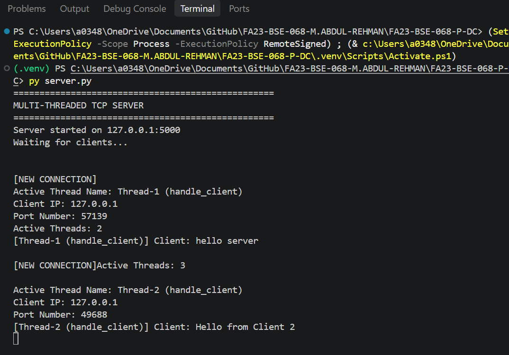

# Multi-Threaded TCP Client-Server Application

A simple Python socket-programming project that demonstrates communication between a TCP server and one or more clients.

The server listens on `127.0.0.1:5000`, accepts client connections, and creates a separate thread for each connected client. Messages received from a client are sent back as an acknowledgement.

## Project Context

This project was developed as a practical demonstration of:

- TCP socket communication
- Client-server architecture
- Multi-threading in Python
- Handling multiple client connections
- Thread synchronization using `threading.Lock`
- Sending and receiving messages over a network connection

## Features

- Multi-threaded TCP server
- Supports multiple clients
- Echo-style server responses
- Displays client IP address and port number
- Uses a lock to synchronize message responses
- Simple command-line interface
- Type `exit` to close the client connection

## Project Structure

```text
.
├── server.py       # Multi-threaded TCP server
├── client.py       # TCP client
├── server.png      # Server execution screenshot
├── client 2.png    # Client execution screenshot
├── client out put.png
└── output 1.png
```

## Requirements

- Python 3.8 or later
- Windows, Linux, or macOS
- No external Python packages are required

The application uses only Python standard-library modules:

- `socket`
- `threading`

## How to Run

### 1. Clone the repository

```bash
git clone https://github.com/AbdulRehman4t7/FA23-BSE-068-P-DC.git
cd FA23-BSE-068-P-DC
```

### 2. Start the server

Open the first terminal and run:

```bash
python server.py
```

The server must be started before the client.

Expected server output:

```text
==================================================
MULTI-THREADED TCP SERVER
==================================================
Server started on 127.0.0.1:5000
Waiting for clients...
```

### 3. Start the client

Open a second terminal in the same project directory and run:

```bash
python client.py
```

Expected client output:

```text
========================================
TCP CLIENT
========================================
Connected to server.
Type 'exit' to close the connection.

You: Hello Server
Server: Server received: Hello Server

You: How are you?
Server: Server received: How are you?

You: exit
Disconnected from server.
```

## Server Output During a Connection

When a client connects, the server displays connection information similar to:

```text
[NEW CONNECTION]
Active Thread Name: Thread-1 (handle_client)
Client IP: 127.0.0.1
Port Number: 54321
[Thread-1 (handle_client)] Client: Hello Server
```

The client receives the following response:

```text
Server: Server received: Hello Server
```

## Running Multiple Clients

Keep the server running and open additional terminals. Run the client in each terminal:

```bash
python client.py
```

Each client is handled by a separate server thread.

## Configuration

The server and client use the following connection settings:

```python
HOST = "127.0.0.1"
PORT = 5000
```

To use a different port, update `PORT` in both `server.py` and `client.py`.

## Troubleshooting

### Connection refused: `[WinError 10061]`

Start the server first:

```bash
python server.py
```

Then run the client in a separate terminal:

```bash
python client.py
```

Also confirm that both files use the same host and port.

### PowerShell virtual environment

If a virtual environment is included locally, activate it with:

```powershell
Set-ExecutionPolicy -Scope Process -ExecutionPolicy RemoteSigned
& ".\.venv\Scripts\Activate.ps1"
```

Then run:

```powershell
python server.py
```

If the command is not recognized, check the spelling: use `python`, not `pyhton`.

## Learning Outcomes

After completing this project, the following concepts can be understood:

1. Creating TCP sockets with Python.
2. Binding a server to an IP address and port.
3. Listening for incoming client connections.
4. Creating a thread for every client.
5. Sending and receiving encoded messages.
6. Closing sockets safely.
7. Using locks for thread synchronization.

## Screenshots

### Server



### Client


## Author

**M. Abdul Rehman**  
FA23-BSE-068

## License

This project is created for educational purposes.